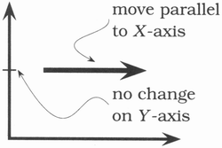
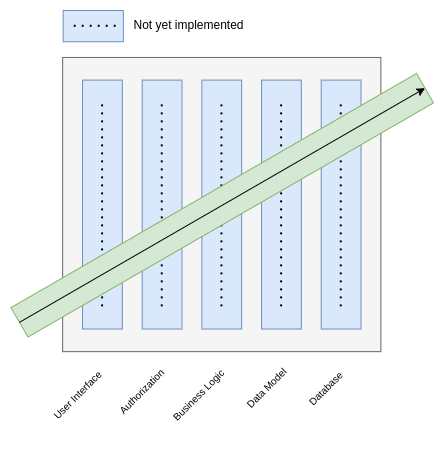
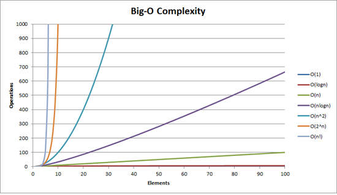

# THE PRAGMATIC PROGRAMMER

 

### 01 - A PRAGMATIC PHILOSOPHY

#### IT’S YOUR LIFE

Why spend your life developing software unless you care about doing it well? It is your life. You own it. You run it. You create it!

#### THE CAT ATE MY SOURCE CODE

Take responsibility for yourself and your actions in terms of your career advancement, your learning and education, your projects, and your day-to-day work. Don’t blame someone or something else, or make up an excuse. Instead of excuses, provide options. Don’t say it can’t be done; explain what can be done to salvage the situation.

When you find yourself saying, “I don’t know”, be sure to follow it up with “- but I’ll find out”

#### SOFTWARE ENTROPY

There are many factors that can contribute to software rot. The most important one seems to be the psychology, or culture, at work on a project. Psychologists have done studies that show hopelessness can be contagious, so don’t live with broken windows (bad design, wrong decisions, or poor code).

#### STONE SOUP AND BOILED FROGS

Be a catalyst for change. You can’t force change on people. Instead, show them how the future might be and help them participate in creating it. So, remember the big picture, don’t get so engrossed in the details that you forget to check what’s happening around you.

#### GOOD-ENOUGH SOFTWARE

All systems must meet their users’ requirements to be successful, and meet basic performance, privacy, and security standards. The scope and quality of the system you produce should be discussed as part of that system’s requirements.

#### YOUR KNOWLEDGE PORTFOLIO

Your ability to learn new things is your most important strategy asset, then make learning a habit. Tips:

- Invest regularly - Habit
- Diversify - More valuable your are
- Manage-risks - Don’t put your technical eggs in one basket
- Buy low, sell high - See the opportunities
- Review and rebalance - Don’t be static, see all the scenario regularly

#### COMMUNICATE

Having the best ideas, the finest code, or the most programmatic thinking is ultimately sterile unless you can communicate with other people. A good idea is an orphan without effective communication.

 

### 02 - A PRAGMATIC APPROACH

#### THE ESSENCE OF GOOD DESIGN

Good design is easier to change than bad design. Try to make what you write replaceable, that way, whatever happens in the future, this chunk of code won’t be a roadblock. It seems extreme, but actually it’s what you should be doing all the time, anyway. It’s really just thinking about keeping code decoupled and cohesive.

#### DRY - THE EVILS OF DUPLICATION

Every piece of knowledge must have a single, unambiguous, authoritative representation within a system. Types of duplication:

- **Imposed duplication**: Developers feel they have no choice—the environment seems to require duplication.
- **Inadvertent duplication**: Developers don't realize that they are duplicating information.
- **Impatient duplication**: Developers get lazy and duplicate because it seems easier.
- **Interdeveloper duplication**: Multiple people on a team (or on different teams) duplicate a piece of information.

#### ORTHOGONALITY

With orthogonality you reduce the interdependence among the system’s components. Two or more things are orthogonal if changes in one do not affect any of the others.

This approach benefits your systems with: increase productivity and reduce risks. Other than, simple components can be designed, coded, tested, and then forgotten, there is no need to keep changing existing code as you add new code.

#### REVERSIBILITY

Basically nothing is forever - and if you rely on some fact, you can almost guarantee that it will change, so, what don’t you make it easy to change? There are no final decisions, no decision is cast in stone. Instead, consider each as being written in the sand at the beach, and plan for change.

#### TRACER BULLETS

Tracer bullets let you home in on your target by trying things and seeing how close they land when you're building something that hasn't been built before.

Your users have never seen a system like this before, their requirements may be vague and sometimes you may be using algorithms, techniques, languages, or libraries you aren't familiar with, in a nutshell, you face a large number of unknowns. Projects take time to complete, you can pretty much guarantee the environment you're working in will change before you're done.

We need something that gets us from a requirement to some aspect of the final system quickly and visibly. It simply is not fully functional. However, once you have achieved an end-to-end connection among the components of your system, you can check how close to the target you are, adjusting if necessary. Once you're on target, adding functionality is easy.

- Users get to see something working early
- Developers build a structure to work in
- You have an integration platform
- You have something to demonstrate
- You have a better feel for progress

#### PROTOTYPE AND POST-IT NOTES

Prototype is a learning experience. Its value lies not in the code you produce, but in the lesson you learn. Prototypes are designed to answer just a few questions, so they are much cheaper and faster to develop than applications that go into production. You can prototype Architecture, New functionality in an existing system, Structure or contents of external data, Third-party tools or components, Performance issues, User interface design.

#### DOMAIN LANGUAGES

Your language influences how you think about a problem. Programming close to the problem domain is bound to be a good influence to reach the solution. Design and code in the language of the problem. The language of the problem domain may also suggest a programming solution, spend time on it.

#### ESTIMATING

Estimate before you start and ask someone who's been in a similar situation in the past. You’ll spot potential problems up front.

- Understand What's Being Asked
- Build a Model of the System
- Break the Model into Components
- Give Each Parameter a Value
- Calculate the Answers
- Keep Track of Your Estimating Prowess
- Estimating Project Schedules

The only way to determine the timetable for a project is by gaining experience on that same project. Practice incremental development, repeating the following steps:

- Guess estimation
- Check requirements
- Analyze risk
- Design, implement, integrate
- Validate with the users
- Repeat

 

### 03 - THE BASIC TOOLS

#### THE POWER OF PLAIN TEXT

Plain text won’t become obsolete. It helps leverage your work and simplifies debugging and testing. The best format for storing knowledge persistently is plain text. With plain text we give ourselves the ability to manipulate knowledge, both manually and programmatically, using virtually every tool at our disposal.

#### SHELL GAMES

Use the shell when graphical user interfaces don’t cut it.If you do all your work using GUIs, you are missing out on the full capabilities of your environment. You won't be able to automate common tasks, or use the full power of the tools available to you.

A benefit of GUIs is WYSIWYG - what you see is what you get. The disadvantage is WYSIAYG - what you see is all you get.

#### POWER EDITING

An editor is your most important tool. Know how to make it do what you need, quickly and accurately. Learn the commands that make your life easier.

#### VERSION CONTROL

Always. Even if you are a single-person team on a one-week project. Even if it’s a “throw-away” prototype. Even if the stuff you’re working on isn’t source code. Make sure that everything is under version control. Version control is a time machine for your work; you can go back and fix anything.

#### DEBUGGING

Don't waste a single neuron on the train of thought that begins "but that can't happen" because quite clearly it can, and has. Try to discover the root cause of a problem, not just this particular appearance of it.

The best way to start fixing a bug is to make it reproducible, so to do that, you need a good mod to debug your source code. Another important thing, It doesn’t really matter whether the bug is your fault or someone else’s—it is still your problem, and it still needs to be fixed.

Read the Damn Error Message - Most exceptions tell both what failed and where it failed. If you’re lucky you might even get parameter values.

Don’t Assume It—Prove It - Prove your assumptions in the actual environment—with real data and boundary conditions.

#### TEXT MANIPULATION

You spend a large part of each day working with text. Why not have the computer do some of it for you?

#### ENGINEERING DAYBOOKS

Try keeping an engineering daybook. Here are the benefits:

- It is more reliable than memory;
- It gives you a place to store ideas that aren’t immediately relevant to the task at hand;
- It acts as a kind of rubber duck.

Use paper, there’s something special about the act of writing compared to typing.

 

### 04 - PRAGMATIC PARANOIA

#### DESIGN BY CONTRACT

Use contracts to document and verify that code does no more and no less than it claims to do . To implement design by contract, enumerate what the input domain range is, what the boundary conditions are, and what the routine promises to deliver - or more importantly, what it doesn’t promise to deliver. Use:

- Preconditions
- Postconditions
- Invariants

#### DEAD PROGRAMS TELL NO LIES

All errors give you information. Pragmatic Programmers tell themselves that if there is an error, something very, very bad has happened. A dead program normally does a lot less damage than a crippled one. When your code discovers that something that was supposed to be impossible just happened, your program is no longer viable.

#### ASSERTIVE PROGRAMMING

If it can’t happen, use assertions to ensure that it won’t. Assertions validate your assumptions. Use them to protect your code from an uncertain world.

- Assertions are also useful checks on an algorithm's operation.
- Don't use assertions in place of real error handling.
- Leave Assertions Turned On, unless you have critical performance issues.

#### HOW TO BALANCE RESOURCES

Where possible, the function or object that allocates a resource should be responsible for deallocating it. Keep the scope of mutable variables and open resources short and easily visible.

#### DON’T OUTRUN YOUR HEADLIGHTS

Small steps always; check the feedback; and adjust before proceeding. Much of the time, tomorrow looks a lot like today. But don’t count on it, only look ahead as far as you can see.

 

### 05 - BEND, OR BREAK

#### DECOUPLING

Decoupling is the technique to ensure orthogonality. It can be done by ensuring you don’t operate on the object state, instead, ask the object to make changes. Global variables, method call chaining & inheritance are just some examples that add coupling.

Always think that decoupled Code is Easier to change, whereas coupling ties things together, so that it’s harder to change just one thing. Don’t get values from an object, transform them, and then stick them back. Make the object do the work.

Be careful about how many other modules you interact with and how you came to interact with them. Traversing relationships between objects directly can quickly lead to a combinatorial explosion.

Don’t Chain Method Calls - Try not to have more than one dot when you access something. If you need an important thing to be, Wrap It in an API, but only do that if you really, really want it to be global.

#### JUGGLING THE REAL WORD

Users don’t want to wait for the critical processing your application is doing. They want the applications to be reactive. If we must write an application that handles the real word problems we need to talk about events. To write application that respond events, our application can use some strategy, like:

- Finite State Machine
- The Observer pattern
- Publish / Subscribe
- Reactive Programming and Streams

#### TRANSFORMING PROGRAMMING

All programs transform data, converting an input into an output. And yet when we think about design, we rarely think about creating transformations. Instead we worry about classes and modules, data structures and algorithms, languages and frameworks. We think that this focus on code often misses the point: we need to get back to thinking of programs as being something that transforms inputs into outputs.

When we do, many of the details we previously worried about just evaporate. The structure becomes clearer, the error handling more consistent, and the coupling drops way down.

Thinking of code as a series of nested transformations can be a liberating approach to programming.

#### INHERITANCE TAX

Inheritance is a form of coupling and therefore must be avoided if unnecessary and most of the time, this is the case.
Paradoxically, this is not what you have probably been taught. Using inheritance for behavioral composition and polymorphism is a common practice you find in every OOP textbook. However, in practice it has some serious disadvantages.

Firstly, you might not directly realize this, but when a class is extended it creates coupling between multiple concrete classes. Not only is a child class coupled to a parent, the parent’s parent, and so on. But also, any object which uses this child is now not only coupled to this child, but also to all the ancestors.

Secondly, in a limited domain, it makes sense that a Car is a kind of Vehicle. However, as soon as the domain you are working in becomes more complicated and closer to reality, these models become more complex and nearly impossible to model. For example, what happens when a Car is also a kind of Asset, InsuredItem, and so on. This needs multiple inheritance, not only isn’t that possible in some programming languages, like Java, but when available you end up with complex models that end up just causing you a headache.

Instead use one of these techniques, so that you never need to use inheritance again:

Interfaces: Implementing Interfaces give us polymorphism without inheritance. These declarations don’t normally create any code and a class can implement an unlimited number.

Delegation: By implementing a class instance as an attribute, you can hide all the unnecessary methods of the class you aren’t using. Significantly reducing its complexity. However, this comes at the cost of writing more code.

Mixins. The basic idea of a mixin is simple: you want to be able to extend classes and objects with new functionality without using inheritance. Say you have two related functions called ‘find(id)' and ‘findAll()' and you want multiple classes to be able to use these functions. But you don’t want to use inheritance and delegation adds unnecessary code.

Interfaces make polymorphism explicit without the coupling introduced by inheritance.

#### CONFIGURATION

When code relies on values that may change after the application has gone live, keep those values external to the app. When your application will run in different environments, and potentially for different customers, keep the environment and customer specific values outside the app.

 

### 06 - CONCURRENCY

Concurrency is when the execution of two or more pieces of code act as if they run at the same time. Parallelism is when they do run at the same time.

#### BREAKING TEMPORAL COUPLING

Coupling is when there are two things, one of these things depends on the other thing. For example Class1 depends on Class2. This is bad because if Class2 changes then Class1 will become incorrect and may result in an error. This is why you should try not to couple things or your code will be non-flexible and will break if refactored.

Temporal coupling is similar, but it occurs between sequential method calls when they must stay in a particular order (they depend on things that could change / might not be there yet). Doing this is again non-flexible as trying to refactor this code at a later date will be sticky and probably end up in issues.

Exploit concurrency in your user’s workflow. We’d like to find out what can happen at the same time, and what must happen in a strict order. A common pattern is to take a large piece of work, split it into independent chunks, process each in parallel, then combine the results.

#### SHARED STATE IS INCORRECT STATE

Shared state is a state which is shared between more than one function or more than one data-structure. When the state is immutable (can’t be changed) this is relatively harmless and is basically a memory saving mechanism. When the shared state is mutable (can be changed), it can be hard to reason about. If a shared state is mutable and used simultaneously by multiple threads, then the program will need to use locks or other mechanisms to operate on the state. This makes for more complexity and less modularity.

Random Failures Are Often Concurrency Issues and shared state opens a large can of worms that can often only be fixed by rebooting.

#### ACTORS AND PROCESSES

The actor model allows us to create a system that does not have a shared state, Each actor has a capability of invoking other actors and process each message sequentially. This enables each process to be sequential but the system as a whole to be concurrent.

_An actor is an independent virtual processor with its own local (and private) state. Each actor has a mailbox. When a message appears in the mailbox and the actor is idle, it kicks into life and processes the message. When it finishes processing, it processes another message in the mailbox, or, if the mailbox is empty, it goes back to sleep._

_A process is typically a more general-purpose virtual processor, often implemented by the operating system to facilitate concurrency. Processes can be constrained (by convention) to behave like actors — The Pragmatic Programmer_

#### BLACKBOARDS

Message transfer systems like Kafka & RabbitMQ enable us to implement a laissez-faire system to avoid writing complex workflows and implement actions triggered when a message is received. This enables our systems to be concurrent by executing an action on request. Use blackboards to coordinate disparate facts and agents, while maintaining independence and isolation among participants.

 

### 07 - WHILE YOU ARE CODING

#### LISTEN TO YOUR LIZARD BRAIN

When it feels like your code is pushing back, it’s really your subconscious trying to tell you something’s wrong. Sometimes a design just feels wrong, or some requirement makes you feel uneasy. Stop and analyze these feelings, if you’re in a supportive environment, express them out loud. Explore them, the chances are that there's something lurking in that dark doorway. Listen to your instincts and avoid the problem before it jumps out at you.

#### PROGRAMMING BY COINCIDENCE

Programming by Coincidence means that you don’t know what you are doing. Your code relies on luck and accidental success. You should avoid programming by coincidence and start programming deliberately. Suppose you keep writing a program that works fine and solves all your purposes. One day, it suddenly breaks. And despite spending a significant amount of time and effort you won’t be able to fix it. You won’t be able to get it right. The reason is simple, you never knew why it worked in the first place.
Rely only on reliable things. Beware of accidental complexity, and don’t confuse a happy coincidence with a purposeful plan. List with how to Program Deliberately:

- Always be aware of what you are doing;
- Know how to explain the code to a junior programmer;
- Don't code in the dark, know the project technologies and business rules;
- Proceed from a plan;
- Rely only on reliable things;
- Document your assumptions, ex: design by contract;
- Don't just test your code, but test your assumptions as well;
- Prioritize your effort and spend time on the important things;
- Don't be a slave to history. Don't let existing code dictate future code.

#### ALGORITHM SPEED

The estimation of the speed of an algorithm is denoted by O(n), where n is the number of items that are being processed. n can be replaced by other polynomials, factorials or logarithms.

- O(1): Constant (access element in array, simple statements)
- O(lg(n)): Logarithmic (binary search) lg(n) = lg2(n)
- O(n): Linear (Sequential search)
- O(n lg(n)): Worse than linear but not much worse(average runtime of quicksort, headsort)
- O(n²): Square law (selection and insertion sorts)
- O(n³): Cubic (multiplication of 2 n x n matrices)
- O(Cⁿ): Exponential (traveling salesman problem, set partitioning)

#### REFACTORING

Refactoring is a controlled technique for improving the design of an existing code base. Its essence is applying a series of small behavior-preserving transformations, each of which "too small to be worth doing". However the cumulative effect of each of these transformations is quite significant. By doing them in small steps you reduce the risk of introducing errors. You also avoid having the system broken while you are carrying out the restructuring - which allows you to gradually refactor a system over an extended period of time.

You need to refactor when you encounter some of these problems in your code:

- Duplication;
- No orthogonal design;
- Outdated knowledge;
- Performance.

Some tips to refactor your code in the best way:

- Don't try to refactor and add functionality at the same time;
- Make sure you have good tests before you begin refactoring;
- Take short, deliberate steps.

Refactoring is about a disciplined technique for restructuring an existing body of code, altering its internal structure without changing its external behavior

#### TEST TO CODE

First, let's make sure that testing is not about finding bugs but yes a perspective into your code, that gives you feedback about its design, api, and coupling. The major benefits of testing happen when you think about and write the tests, not when you run them, because before you can test something, you have to understand it, and that’s an important value.

Treat test code with the same care as any production code. Keep it decoupled, clean, and robust.

#### PROPERTY-BASED TESTING

Property-based tests will try things you never thought to try, and exercise your code in ways it wasn't meant to be used. It’s powerful because you set up some rules for generating inputs, set up some assertions for validating output, and then just let it rip.

So, what should I do when a property-based test fails? When it happens you must find out what parameters it was passing to the test function, and then use those values to create a separate, regular, unit test. Here there are some benefits of using property-based testing:

- Cover the scope of all possible inputs: by construct, it does not restrict the generated inputs if not asked to do so. Consequently it can theoretically generate all possible inputs and cover the whole range of strings, integers or whatever type required by the system under test.

- Shrink the input in case of failure: whenever it fails, the framework tries to reduce the input to a smaller input. For instance: if the condition of the failure is the existence of a given character in a string it should return the one-character string having only this character. This is certainly one of the most interesting features of such an approach as most of the time the failure can be summarized by a very small case.

- Reproducible and replaceable: each time it runs a property test, a seed is produced in order to be able to re-run the test again on the same datasets. Any run failure causes the framework to print both the failing case and the seed in order to be able to fully reproduce the run.

#### STAY SAFE OUT THERE

Nowadays, a large number of incidents happen because the developers were careless. In the vast majority of cases, it's not because the attackers were terribly clever, or even vaguely competent. There are a handful of basic principles that you should always bear in mind:

1. **Minimize attack surface area**
   Simple, smaller code is better. Less code means fewer bugs, fewer opportunities for a crippling security hole.

2. **Principle of least privilege**
   Don't automatically grab the highest permission level, such as root or Administrator. If needed, then take it, do the minimum amount of work, and relinquish your permission quickly to reduce the risk.

3. **Secure defaults**
   The default settings on your app, or for your users on your site, should be the most secure values.

4. **Encrypt sensitive data**
   Don't leave personally identifiable information, financial data, passwords, or other credentials in plain text.

5. **Maintain security updates**
   You need that security patch, but as a side effect, it breaks some portion of your application. Don't decide to wait, apply security patches quickly.

Complex code creates a breeding ground for bugs and opportunities for attackers to exploit, so keep it simple and minimize attack surfaces.

#### NAMING THINGS

Name to express your intent to readers, and rename as soon as that intent shifts. Things should be named according to the role they play in your code. This means that, whenever you create something, you need to pause and think “What is my motivation to create this?”

There are only two hard things in computer science: cache invalidation and naming things.

 

### 08 - BEFORE THE PROJECT

#### THE REQUIREMENTS PIT

Requirements are normally buried deep beneath layers of assumptions, misconceptions, and politics. Even worse, often they don’t really exist at all. That’s the moment where the programmers come in. Our job is to help people understand what they want.

Your role in this is to interpret what the client says and to feed back to them the implications. You do that by generating feedback, and letting them use that feedback to refine their thinking.

There’s a simple technique for getting inside your clients’ heads that isn’t used often enough: become a client.

The client doesn’t really know what they want up front, so think about early feedback, with prototype pr tracer bullets. That way, will let your clients say “yes, it does what I want, but not how I want”

Another important thing is to use a project glossary, because It’s hard to succeed on a project if users and developers call the same thing by different names or, even worse, refer to different things by the same name.

#### SOLVING IMPOSSIBLE PUZZLES

The key to solving puzzles is both to recognize the constraints placed on you and to recognize the degrees of freedom you do have, for in those you’ll find your solution. When faced with an impossible problem, identify the real constraints. Ask yourself: “Does it have to be done this way? Does it have to be done at all?”

Sometimes you need to work on something different to really identify the solution of an impossible puzzle, so walk the dog or sleep on it.

#### WORKING TOGETHER

You will be faced with an impossible project or task in your career, then why not work with another coworker and have other opinions and thoughts, asking questions and having discussions while coding? When we completely work together with our teammates, we commonly apply a pair-programming methodology while implementing.

Pair programming is an agile software development technique in which two programmers work together at one workstation. One, the driver, writes code while the other, the observer or navigator, reviews each line of code as it is typed in. The two programmers switch roles frequently.

When we encounter more difficult issues, we may use mop-programming, which allows more than two people to work with the same issue. A business analyst, tester, etc., can be one of them. Only one operates a keyboard while the others talk about a problem that is emerging.

#### THE ESSENCE OF AGILITY

Agile is an iterative approach to project management and software development that helps teams deliver value to their customers faster and with fewer headaches. In a nutshell, agile is how you deal with something.

For a pragmatic programmer, we code the software by iteratively gathering and acting with feedback. Here is the agile procedure that the authors refined as follows:

1. Work out where you are.
2. Make the smallest meaningful step towards where you want to be.
3. Evaluate where you end up, and fix anything you broke.

This loop applies outside the scope of a single project. Teams should apply it to review their process and how well it worked, a team that doesn’t continuously experiment with their process is not an agile team.

 

### 09 - PRAGMATIC PROJECTS

#### PRAGMATIC TEAMS

Team should be small and stable, where everyone trusts each other and depends on each other. Let’s recast some of the previous sections in terms of teams.

1. **No broken windows**: don’t live with the broken windows. If your teammates are okay with the broken windows and ignore fixing them as fast as possible when the broken windows are considered a software debt, your team will tend to produce and deliver more broken windows.
2. **Boiled frogs**: the boiled frog is comparable to anyone who has unknown changes. The frog will become boiled unconsciously. So, look at the big picture, don’t focus only on what you are doing and encourage everyone to actively monitor the environment for changes.
3. **Scheduler your knowledge portfolio**: Regularly invest in team knowledge and manage your risks. Schedule important meetings and makes It happen - If you don’t schedule it, it’s not going to happen. Schedule reflection, experimentation, learning and skills improvement.
4. **Communicate team presence**: great project teams have distinct people and your coworker could interpret the one sentence with a different meaning. So, try to explain what you are thinking and reassure that your teammates understand what you mean.
5. **Don’t repeat yourself**: eliminate duplication work between members of a team, this duplication leads to wasted effort. Good communication is the key to avoiding these problems.
6. **Team tracer bullet**: Organize Around Functionality, Not Job Functions. Don’t separate UI/UX designers from coders, frontend from backend, testers from data modelers, design from deployment. Build teams so you can build code end-to-end, incrementally and iteratively. With a tracer bullet approach, you can implement very small bits of functionality very quickly, and get immediate feedback on how well your team communicates and delivers.
7. **Automation**: Apply automation for consistent development software. Why struggle with code formatting standards when your editor or IDE can do it for you automatically? Why do manual testing when the continuous build can run tests automatically?
8. **Know when to stop adding paint**: remember that teams are made up of individuals. Give each member the ability to shine in their own way. Give them just enough structure to support them and to ensure that the project delivers value.

#### COCONUTS DON’T CUT IT

Why are you even using that particular development method? or that framework? or that testing technique? Was it actually well-suited for the job at hand? Does it work well for you? Or was it adopted just because it was benign use by the attest internet -fueled success story?

Don’t adopt a development method or technique just because other companies are doing it. Adopt what works for your team, in your context. You need the ability to see beyond the existing rules and explicit possibilities for advantage. Before imitating companies like Spotify, Netflix, Amazon and others, get yourself a few hundred thousand servers and ten of millions of users.

#### PRAGMATIC STARTER KIT

The pragmatic started kit is composed by these three legs that support every project

- Version control: use version control to drive builds, tests, and releases.
- Regression Tests: test early, test often, test automatically. Tests that run with every build are much more effective than test plans that sit on a shelf. Introduce bugs on purpose in a separate copy of the source to verify that testing will catch them. Identify and test significant program states. Testing just lines of code isn’t enough. Once a human tester finds a bug, it should be the last time a human tester finds that bug. Automatic tests should check for it from then on.
- Full automation: As previously mentioned, try to let your team works on full automation, for example, CI/CD, etc

#### DELIGHT YOUR USERS

Our goal as a developer is to delight users. That’s why we’re here. Our users are not particularly motivated by code. Instead they have a business problem that needs solving within the context of their objectives and budget. Their belief is that by working with your team they’ll be able to do this. And now, here is how you can do this against them:

- Make sure everyone on the team is totally clear about these expectations.
- When making decisions, think about which path forward moves closer to those expectations.
- Critically analyze the user requirements in light of the expectations. On many projects we’ve discovered that the stated “requirement” was in fact just a guess at what could be done by technology: it was actually an amateur implementation plan dressed up as a requirements document. Don’t be afraid to make suggestions that change the requirement if you can demonstrate that they will move the project closer to the objective.
- Continue to think about these expectations as you progress through the project.

Develop solutions that produce business value for your users and delight them every day.

#### PRIDE AND PREJUDICE

Programmatic programmers don’t shrink from responsibility. Instead, we rejoice in accepting challenges and in making our expertise well known. If we are responsible for a design, or a piece of code, we do a job we can be proud of.

Artisans of an earlier age were proud to sign their work. You should be, too and your signature should come to be recognized as an indicator of quality. People should see your name on a piece of code and expect it to be solid, well written, tested, and documented. A really professional job. Written by a professional.

##### IT’S YOUR LIFE. SHARE IT. CELEBRATE IT. BUILD IT. AND HAVE FUN!
